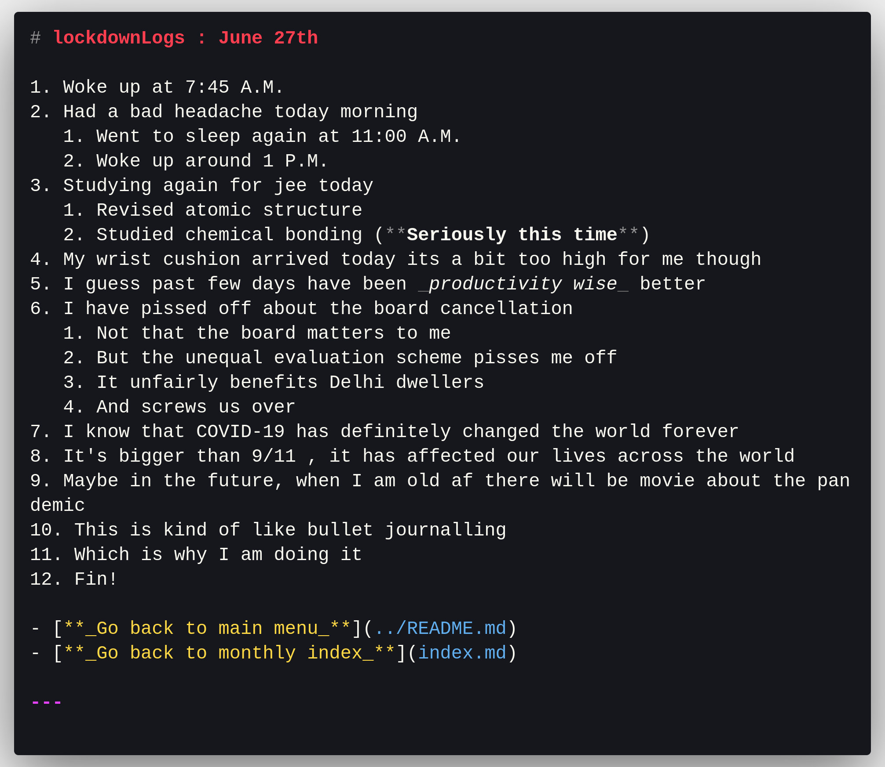

# lockdownLogs

## Table of contents

- [Why does this exist?](#about)
- [Future log](#future-log)
- [Additional Notes](#notes)

## Log Menu

- [June 2020](june2020/index.md)
- [July 2020](july2020/index.md)

## <a name="about">Why does this exist?</a>

- This exist for multiple reasons including but not limited to:
  - This helps me track my ~~life~~ **_studies_**
  - This also makes me practice markdown (_which is great!_)
  - This may also provide me with catharsis ~~later?~~ in the future
  - This always helps practice typing
  - Anyway, bottom line is that it gives me something to do

## <a name="future-log">Future log</a>

- _Here's what's to come for me in the near future goes_
- Prolonged stay at home(Self Quarantine)
- I will be graduating from high school quite soon (And I'm not at all ready to be an adult)
- Sidenote: I'm mostly done with school, only the rubber stamp(the certificate) is left
- My various entrance exams ~~will~~ might be held soon (COVID-19 has put a real damper on it, though)
  - Which doesn't really help me because the exam-date have become a shifting goal post
- I still am not quite sure about what I am **supposed/meant** to do with my life?
  - I am considering becoming a math professor but spending **another 10 years** studying is making me hesitate (Also the **low income**)
  - There's always the option of engineering but I know that engineering colleges are real hell-holes
  - So I guess I'll keep at it (~~But I'm not too sure what I'm supposed write in these logs~~)
  <!-- That's enough for today will add to this  -->

## <a name="notes">Additional Notes</a>

- I intend for this to be chronicling my journey through this new world under lockdown
  - _Sidenote : my logs only started after lockdown where I live has been lifted for more than 3 weeks_
  - _Another sidenote : although lockdown has been lifted, **Life will never quite be the same anymore**_
- It might just end up being a dud not really something like what I fantasized
- I envisioned of these logs as a kind of bullet journal(not really though)
- I have been logging for a few days now, but I find not a lot remarkable enough to log.
- I suppose I can do a better job.
- I have been learning vim
- I have made vim almost like vscode
  - I can open multiple files in tabs
  - I will try to write today's log completely in vim (today is 10th july)
- I also have switched to linux
  - **Distro : Manjaro(xfce)**
  - **Terminal emulator : alacritty**

## A sample taken from june 27th

**Used polacode for the img**

**Total days missed : _5_**
